# Instagram Clone

### *<strong>Instagram Clone (Both frontend and backend) created with Python and Django .</strong>*
 

## Features

 * Post photo posts from camera or gallery
   * Like posts
   * Comment on posts
        * View all comments on a post
 * Profile Screen
   * Follow / Unfollow Users.
   * Change Profile image amd Bio.
   * Edit profile 
* User can send message's (still under development) 
   * Delete messages.  
   * Chat Screen.(under development)
        * Like messages
        * Chat with any user.
        * Share images while chatting
        
 

# Screenshots  : 
 

## <em>Login and Registration page</em> :
  

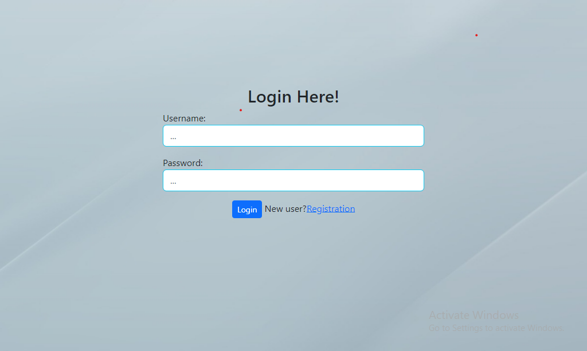

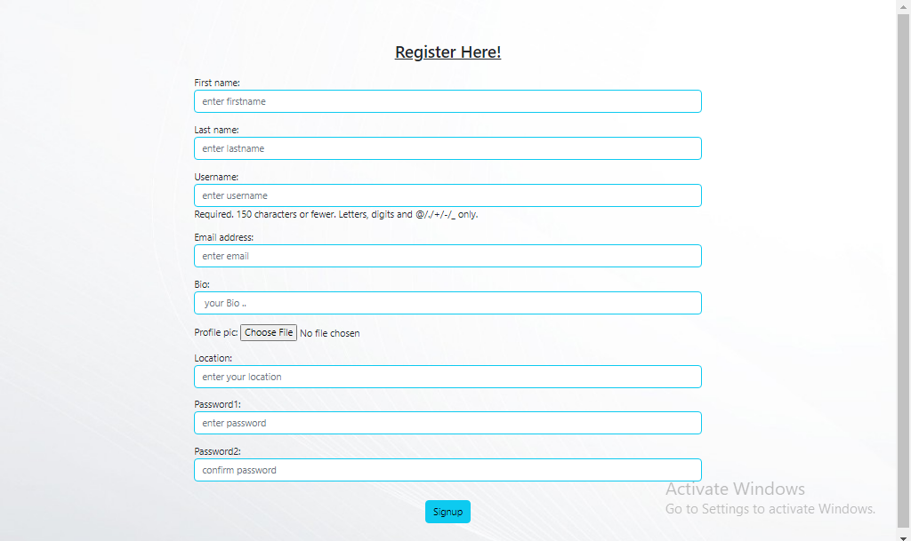

 

## <em>Home Page Views</em>  :
  

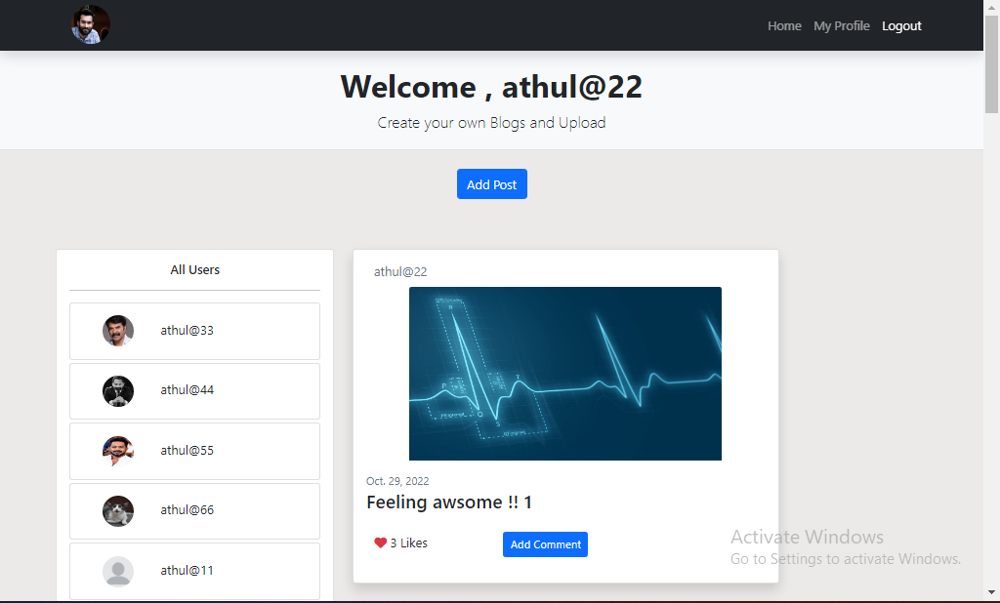

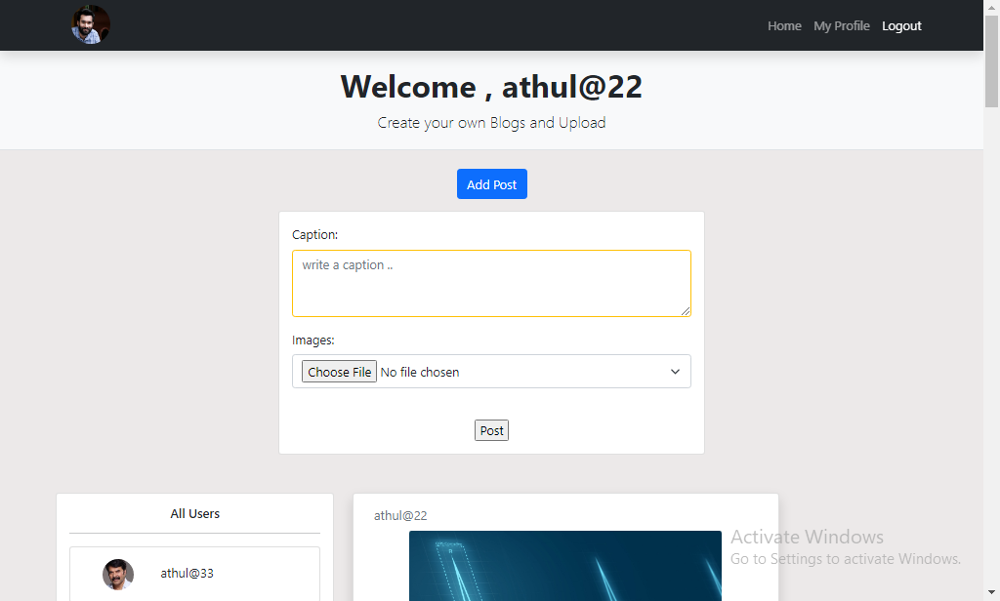

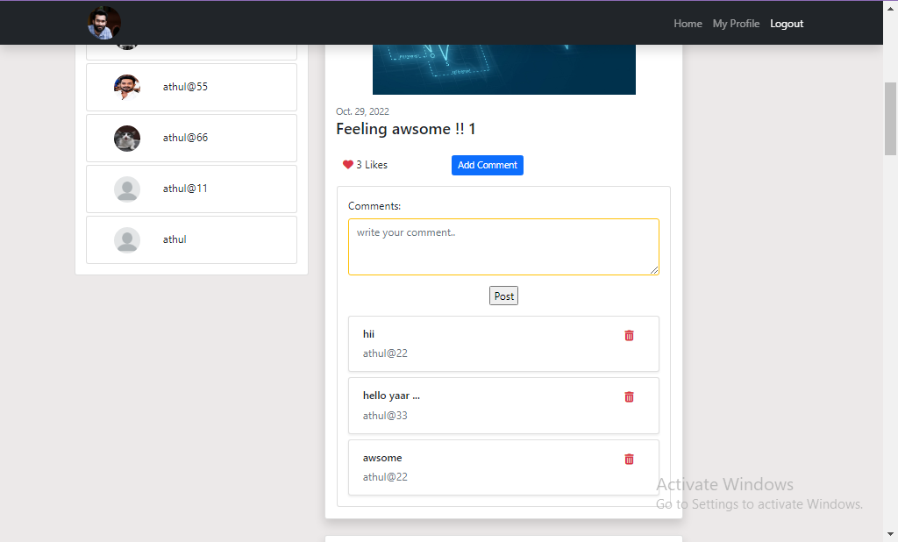

 

## <em>User Profile View</em> :
  

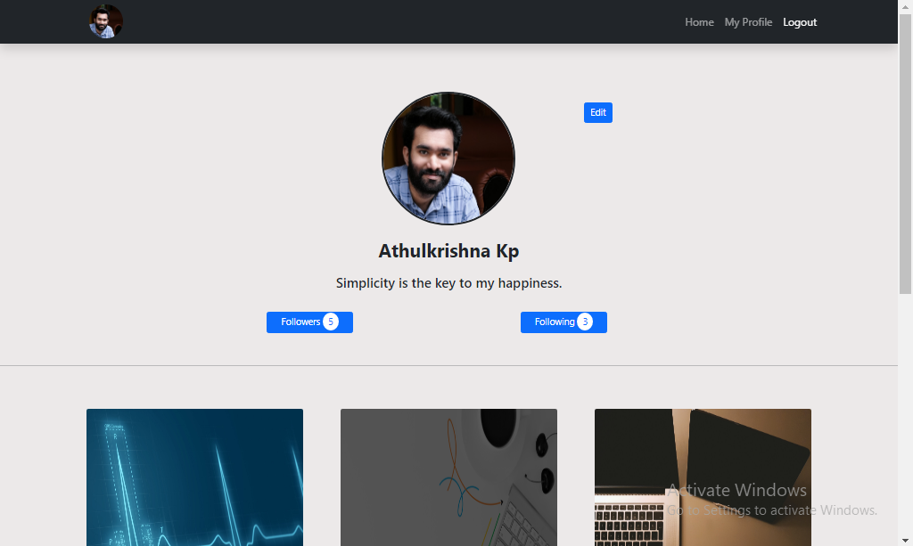

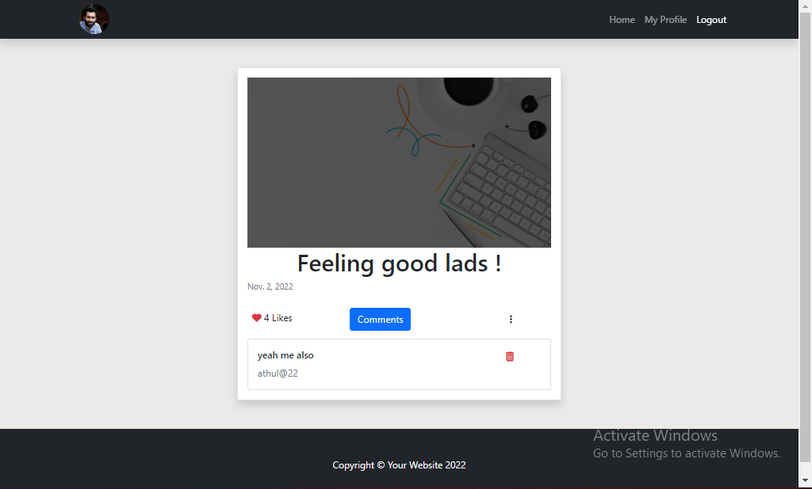

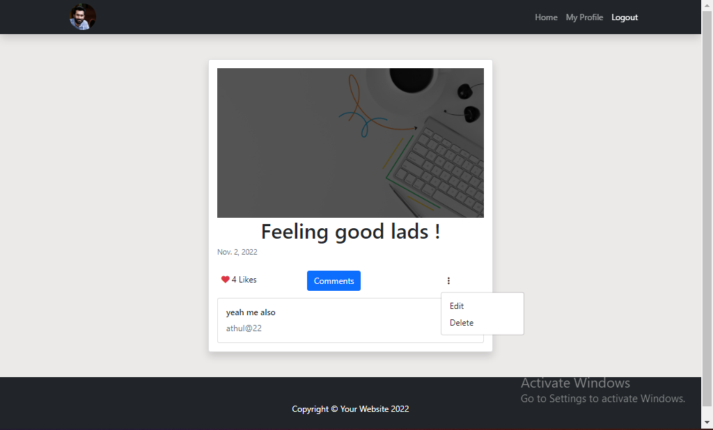

 

## <em>Other Users Profile</em> :
  

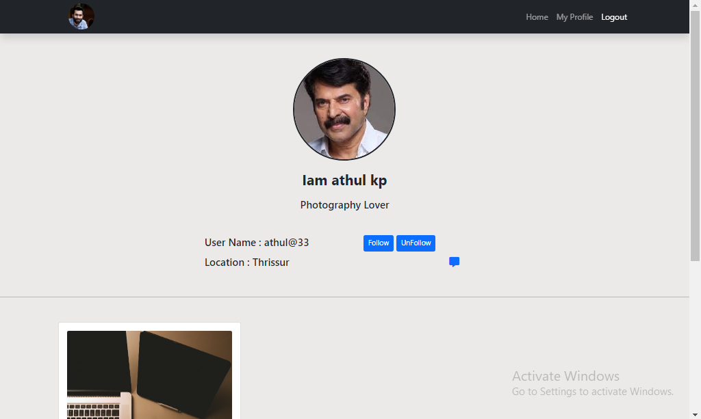

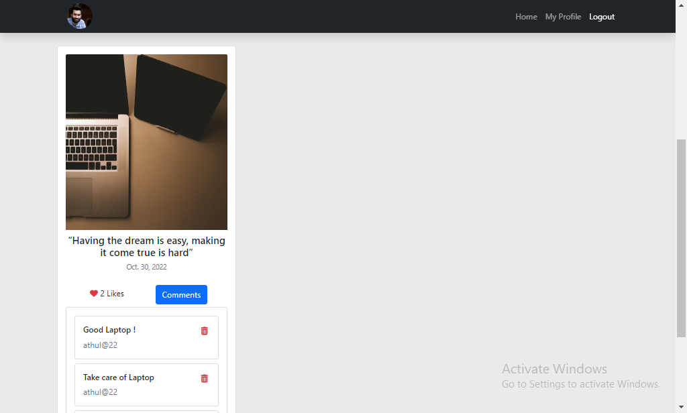

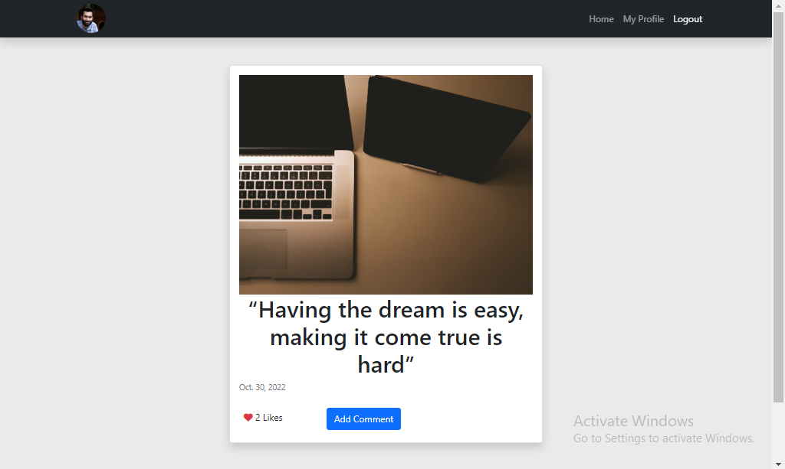

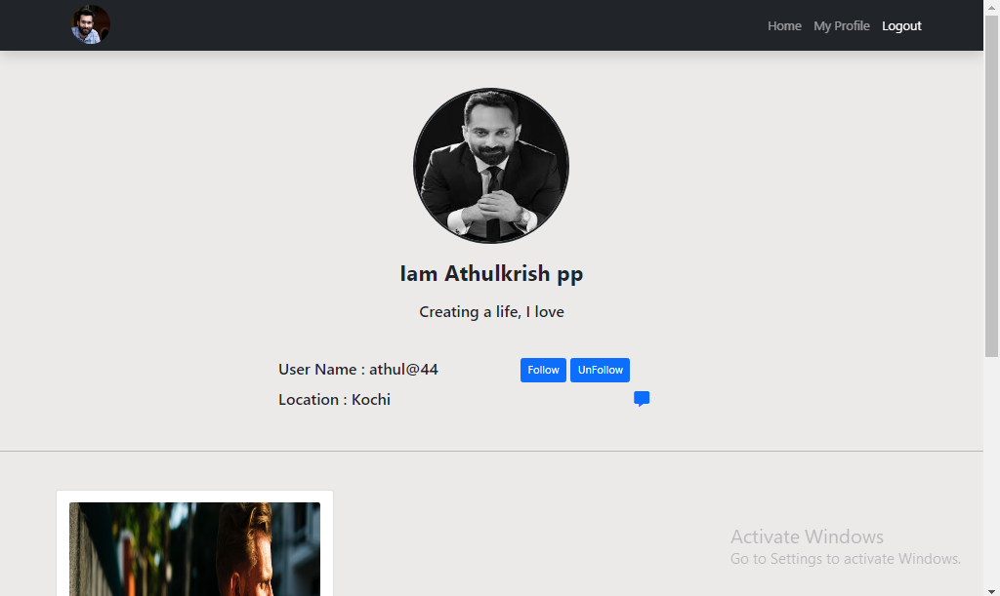

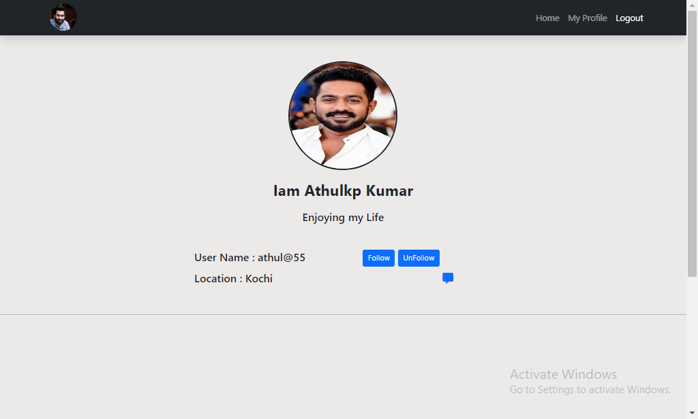

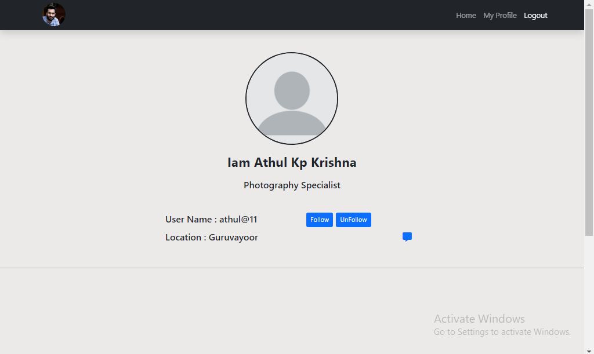

 

## <em>Chat Screen : (Under Development)</em>
  

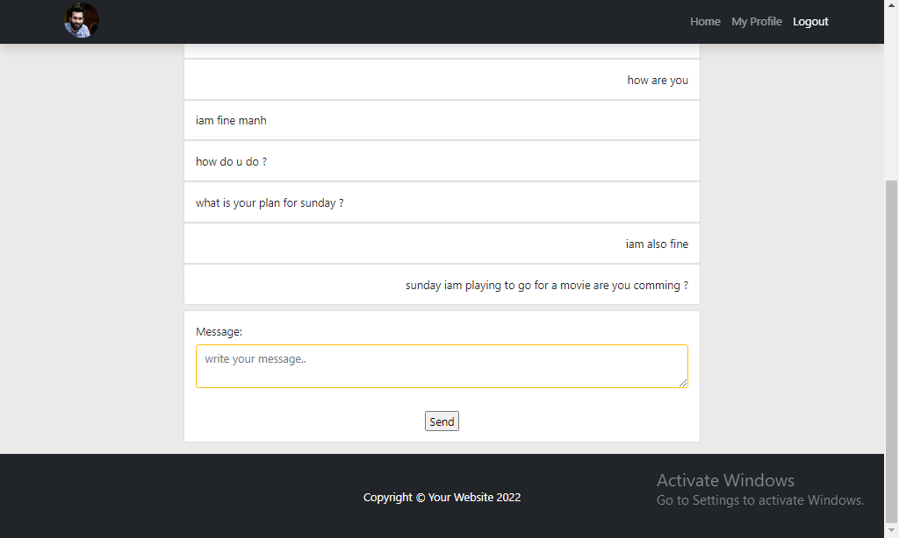

 

## <em>Followers list & Following List :</em>

  

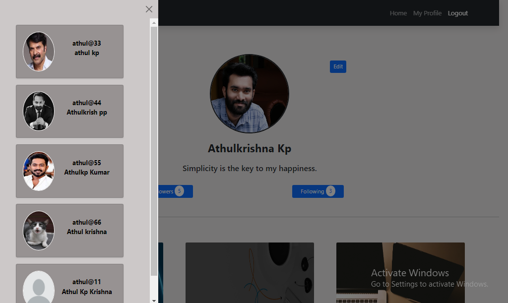

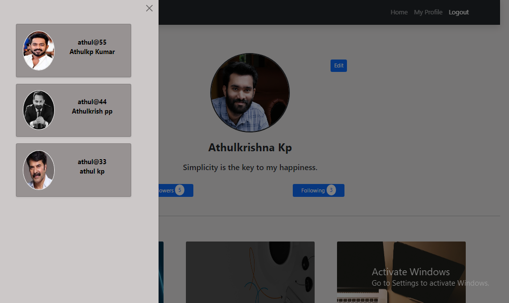
